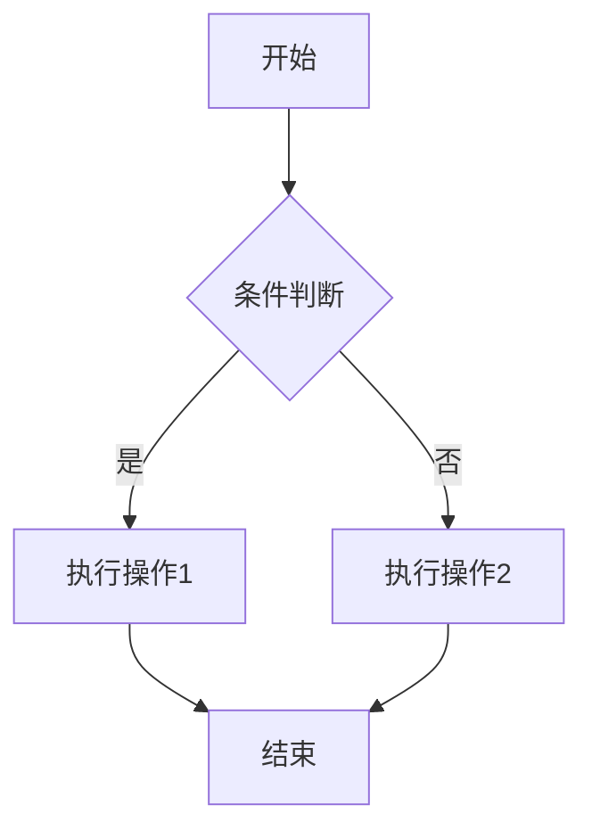

# 公式测试

行内公式：$E=mc^2$

块级公式：

$$
\int_0^1 x^2 dx = \frac{1}{3}
$$

# 使用说明

## 提示框
!!! note "提示"
    这是一个提示框。

## 数学公式
行内：$E = mc^2$  
块级：
$$
\int_0^1 x^2 dx = \frac{1}{3}
$$

## Mermaid 流程图

```mermaid
flowchart TD
  A[开始] --> B{条件判断}
  B -->|是| C[执行操作1]
  B -->|否| D[执行操作2]
  C --> E[结束]
  D --> E[结束]
```

